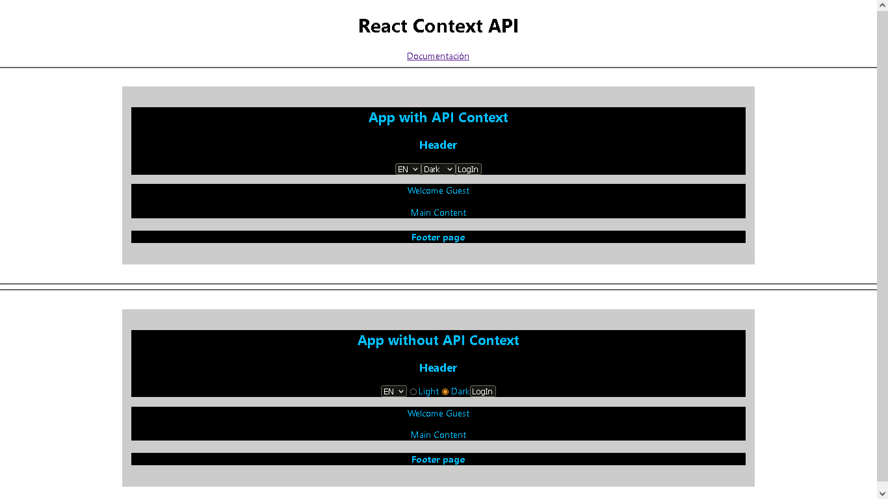

<h1 style='color: orange;'>React Context testing</h1>

## Description

Web app developed to compare **App without React context** vs. **App with React context**

### **Features**

+ **Theme dark**

+ **Language switch**

+ **Log User (mock)**

## **Follow me** 💬

| **Author** | **GitHub** | **Twitter** | **Linkedin** |
| :---: | :---: | :---: | :---: |
| Crispthofer Rincon | [crispthoalex](https://github.com/crispthoalex) | [@crispthoalex](https://twitter.com/crispthoalex) | [carmurrain](https://www.linkedin.com/in/carmurrain) |

##### Julio, 2022. Colombia
